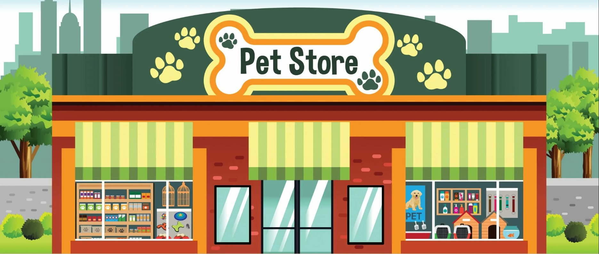
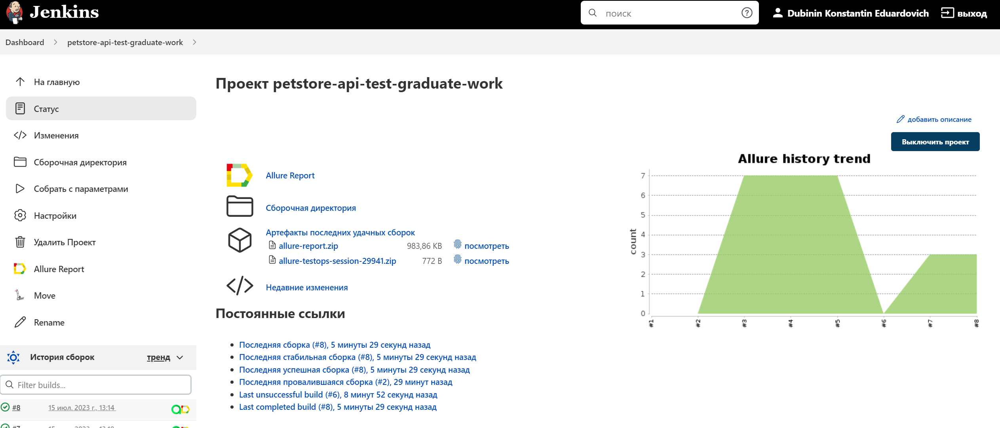
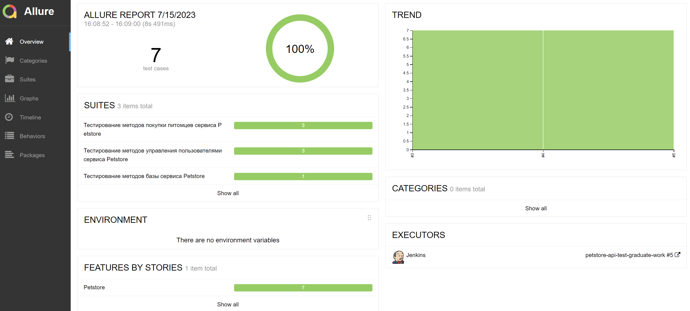
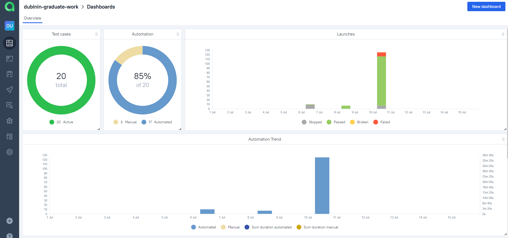
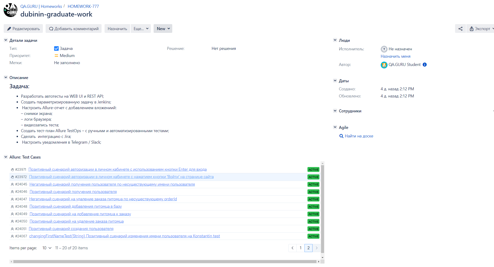
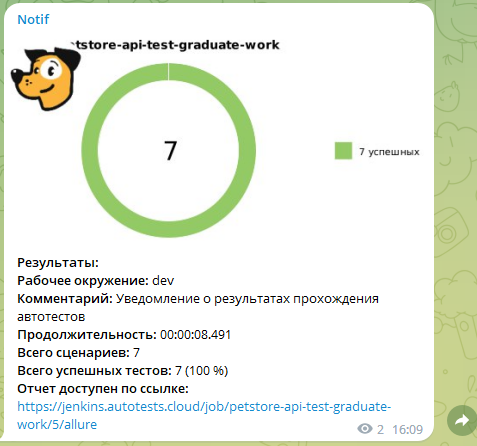
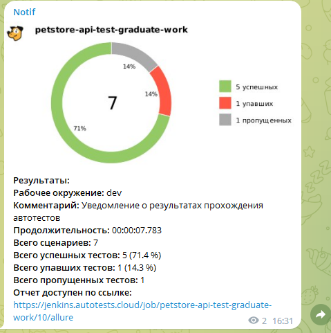

# <span style="color: white"> Дипломая работа по автоматизации тестовых сценариев API сервиса [Petstore](https://petstore.swagger.io/) </span>

#### Petstore — образец приложения, которое можно использовать для практики REST-запросов. Этот сайт имитирует онлайн-зоомагазин, и пользователи могут добавлять и получать информацию о своих питомцах.
<p align="center">

</p>


## :pushpin: Содержание:

- [Использованный стек технологий](#computer-использованный-стек-технологий)
- [Команда на запуск тестов сборки Jenkins](#task-команда-на запуск-тестов-сборки-jenkins)
- [Сборка в Jenkins](#jenkins-сборка-в-jenkins)
- [Пример Allure-отчета](#allure-пример-allure-отчета)
- [Интеграция с Allure TestOps](#testops-интеграция-с-allure-testops)
- [Интеграция с Jira](#jira-интеграция-с-jira)
- [Уведомления в Telegram с использованием бота](#tlg-уведомления-в-telegram-с-использованием-бота)

## :computer: Использованный стек технологий

<p align="center">
<a href="https://www.jetbrains.com/idea/"></a>
<a href="https://www.java.com/"></a>
<a href="https://docs.qameta.io/allure-report/"></a>
<a href="https://qameta.io/"></a>
<a href="https://gradle.org/"></a>
<a href="https://junit.org/junit5/docs/current/user-guide/"></a>
<a href="https://github.com/"></a>
<a href="https://www.jenkins.io/"></a>
<a href="https://telegram.org/?1"></a>
<a href="https://www.atlassian.com/ru/software/jira"></a>
</p>

- В данном проекте автотесты написаны на языке <code>Java</code>.
- В качестве сборщика был использован - <code>Gradle</code>.
- Для тестирования API использованы инструменты <code>REST Assured</code> и <code>Lombock</code>.
- Для удаленного запуска реализована параметризированная джоба в <code>Jenkins</code> с формированием Allure-отчета и отправкой результатов в <code>Telegram</code> при помощи бота.
- Осуществлена интеграция с <code>Allure TestOps</code> и <code>Jira</code>

### :task: Команда на запуск тестов сборки Jenkins

```
clean
${TASK}
```

###  Параметры сборки

* <code>TASK</code> – задача на прогон тестов. Варианты: <code>regress_test</code>, <code>users_test</code>, <code>store_test</code>, <code>pet_test</code>.


## :jenkins: <a href="https://jenkins.autotests.cloud/job/petstore-api-test-graduate-work/"> Сборка в Jenkins</a>
<p align="center">

</p>

## :allure: <a href="https://jenkins.autotests.cloud/job/petstore-api-test-graduate-work/5/allure/"> Пример Allure-отчета</a>


<p align="center">

</p>

## :testops: <a href="https://allure.autotests.cloud/project/3477/dashboards"> Интеграция с Allure TestOps</a>

Выполнена интеграция сборки <code>Jenkins</code> с <code>Allure TestOps</code>.
Результат выполнения автотестов отображается в <code>Allure TestOps</code>
На Dashboard в <code>Allure TestOps</code> отображена статистика пройденных тестов.

<p align="center">

</p>

## :jira: <a href="https://jira.autotests.cloud/browse/HOMEWORK-777"> Интеграция с Jira</a>

Реализована интеграция <code>Allure TestOps</code> с <code>Jira</code>, в тикете отображается информация, какие тест-кейсы были написаны в рамках задачи и результат их прогона.

<p align="center">

</p>

## :tlg:  Уведомления в Telegram с использованием бота

После завершения сборки, бот созданный в <code>Telegram</code>, автоматически обрабатывает и отправляет сообщение с результатом.

| ALL PASSED                            | WITH FAILED AND SKIPPED                |
|---------------------------------------|----------------------------------------|
|  |  |

